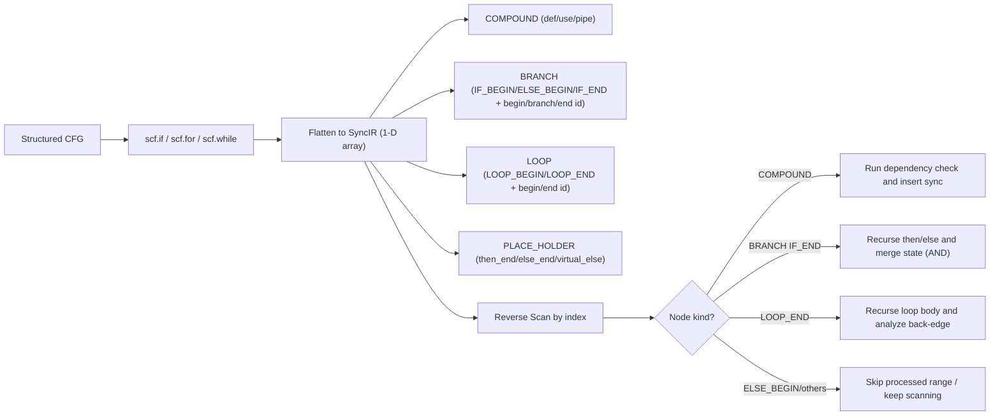
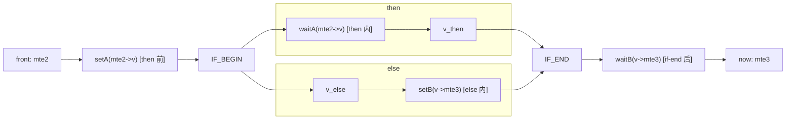
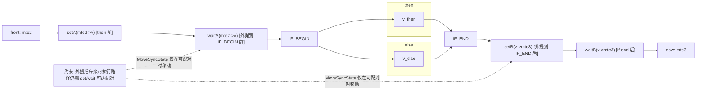
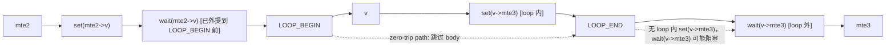
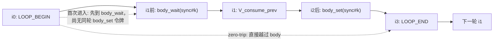
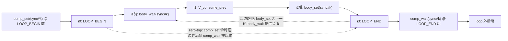

# PTOAS InsertSync 自动同步机制

李圣韬 l00808062

本文围绕三个核心问题展开：依赖如何判定、同步如何插入、event id 如何分配。

---

## 1. 问题的背景：硬件架构带来的乱序风险和同步的需求

在 PTOAS 中，指令不会按源码顺序串行执行。多条 pipe 并行后，只要 producer 和 consumer 落在同一底层内存，就可能发生时序竞争。InsertSync 的职责就是把这种真实依赖转换成最小必要同步。

先约定文中涉及的常见 pipe 类型：

- `PIPE_MTE2`：入搬运，常见 GM -> L1/UB。
- `PIPE_V`：向量计算。
- `PIPE_M`：矩阵计算。
- `PIPE_MTE3`：出搬运，常见 L1/UB -> GM。
- `PIPE_S`：标量和控制辅助。

最常见的数据通路是 `MTE2 -> V/M -> MTE3`。跨 pipe 共享底层内存时，同步是正确性的必要条件。

---

## 2. 流程并不复杂，但顺序很关键

`PTOInsertSync` pass 的顺序如下：

`PTOIRTranslator -> InsertSyncAnalysis -> MoveSyncState -> RemoveRedundantSync -> SyncEventIdAllocation -> SyncCodegen`

这条流水线可以拆成三段：

1. 先识别依赖，生成同步分析对象。
2. 再把同步位置在控制流边界上标注清楚。
3. 最后分配 event id 并落成真实指令。

---

## 3. 依赖识别：def/use + alias 是同一件事的两面

`def/use` 分析不是直接比较 SSA 名字，而是落在 `BaseMemInfo` 上计算。  
其中最关键的字段是 `rootBuffer`、`scope`、`baseAddresses`、`allocateSize`。

hazard 判定按三类关系展开：

- RAW：`now.use` 对 `front.def`
- WAR：`now.def` 对 `front.use`
- WAW：`now.def` 对 `front.def`

命中后处理规则很直接：同 pipe 插 `barrier`，跨 pipe 插 `set/wait`。

### 3.1 alias 到底怎么判

当前实现不是“强证明式 AA”，而是 correctness-first 的 may-alias 规则：

1. `scope` 不同，直接不别名。
2. `GM` 先比较 root，必要时追踪 `realRoot`。
3. 地址和大小都已知，就做区间重叠。
4. 信息缺失（地址未知、size 未知），保守按“可能重叠”。

这套规则在信息不足时会偏保守，但不会牺牲正确性。后续会继续补强动态 shape/offset 场景下的精细分析。

### 3.2 例子：`[V][V][MTE3]`

两个 `V` 在语义上可能写的是同一个 root 下的两个不重叠 subview。  
如果静态阶段能拿到精确 offset/size，系统会判不重叠。  
如果拿不到，会按“可能重叠”处理，此时 `MTE3` 会同时依赖这两个 `V`。

这不是算法错误，而是保守策略带来的结果。

---

## 4. 同步插入：线性、分支、循环

### 4.1 线性序列

在线性序列下，算法是一个双层遍历：

1. 外层：按顺序选当前指令 `now`。
2. 内层：从 `now-1` 向前反扫 `front`。

每次反扫都会维护按 pipe 索引的状态 `alreadySync`。  
它不是全局状态，而是“针对当前 `now`，该源 pipe 的依赖是否已经被某个同步对覆盖”。

一旦 `front` 与 `now` 命中 hazard：

- 同 pipe：在 `now.pipeBefore` 挂 `barrier`。
- 跨 pipe：在 `front.pipeAfter` 挂 `set(src=frontPipe,dst=nowPipe)`，在 `now.pipeBefore` 挂对应 `wait`。

插入后更新 `alreadySync[frontPipe]=true`，用于抑制同类重复同步。

#### 线性例子 A：`[MTE2][V][MTE3]`

这个例子分两轮看最直观。

第一轮，当 `now = V`：

- 反扫到 `front = MTE2`，命中依赖；
- 插入 `set(MTE2->V)`（挂在 `MTE2.pipeAfter`）和 `wait(MTE2->V)`（挂在 `V.pipeBefore`）。

第二轮，当 `now = MTE3`：

- 先扫到 `front = V`，命中依赖，插入 `set(V->MTE3)` + `wait(V->MTE3)`；
- 再往前扫到 `front = MTE2` 时，算法会利用已经存在的同步链路做传递剪枝，不再重复插 `MTE2->MTE3`。

这里的“隐形同步关系”可以理解为：`MTE2 -> V` 与 `V -> MTE3` 叠加后，已经隐含了 `MTE2 -> MTE3` 的顺序约束。

#### 线性例子 B：为什么 `syncIndex` 能识别这条链

上面这个 `[MTE2][V][MTE3]` 场景里，关键不是“看到了某个 set”，而是“识别到匹配的 set/wait 对”。

设 `sync#3` 对应 `MTE2->V` 这组同步：

- `set#3` 在 `MTE2.pipeAfter`
- `wait#3` 在 `V.pipeBefore`

当 `now = MTE3` 反扫时，状态变化是：

1. 先经过 `V.pipeBefore`，看到 `wait#3`，记录 `syncFinder[3]=true`；
2. 再经过 `MTE2.pipeAfter`，看到 `set#3`，且发现 `syncFinder[3]` 已经为真；
3. 因为这一对 `set/wait` 被确认为同一 `syncIndex` 的闭合链条，算法就可以把 `alreadySync[MTE2]` 置为真。

于是后续判定 `front=MTE2` 时，`isAlreadySync` 命中，`MTE2->MTE3` 不再重复插入。

这就是 `syncIndex` 的价值：把“同步链条是否真正闭合”编码成可判定状态，避免只按 pipe 粗粒度去重。

### 4.2 先做一件事：把控制流“拉直”

在同步分析前，`PTOIRTranslator` 会先把结构化控制流（`scf.if/scf.for/scf.while`）转换成一维 `SyncIR` 数组。  
这样做不是为了简化语义，而是为了统一扫描实现：核心算法是“对每个 `now` 做反向扫描”。

但“拉直”不等于丢掉结构。`SyncIR` 里会保留结构节点来恢复语义边界：

- `COMPOUND`：普通指令节点（有 `def/use/pipe`）。
- `LOOP`：`LOOP_BEGIN/LOOP_END`，携带 `beginId/endId`。
- `BRANCH`：`IF_BEGIN/ELSE_BEGIN/IF_END`，携带 `beginId/branchId/endId`。
- `PLACE_HOLDER`：then/else 尾部锚点；无 else 时会有 virtual-else 占位。

每个节点都有稳定 index，因此“线性位置”和“结构边界”可以同时使用。

#### 拉直后的 if/else 示例

```text
[0] COMPOUND  mte2
[1] BRANCH    IF_BEGIN   (begin=1, branch=4, end=7)
[2] COMPOUND  then_v
[3] PLACE_HOLDER (then_end)
[4] BRANCH    ELSE_BEGIN (begin=1, branch=4, end=7)
[5] COMPOUND  else_m
[6] PLACE_HOLDER (else_end / virtual-else)
[7] BRANCH    IF_END     (begin=1, branch=4, end=7)
[8] COMPOUND  mte3
```

#### 拉直后的 loop 示例

```text
[0] COMPOUND  mte2
[1] LOOP      LOOP_BEGIN (begin=1, end=4)
[2] COMPOUND  v
[3] COMPOUND  mte3
[4] LOOP      LOOP_END   (begin=1, end=4)
[5] COMPOUND  tail_v
```

#### CFG 到 SyncIR 的示意图



#### 拉直后如何识别控制流并继续分析

反向扫描并不是一口气按数组扫到底，而是遇到结构节点就切换处理策略：

1. 扫到 `COMPOUND`：按普通依赖规则处理。
2. 扫到 `BRANCH(IF_END)`：调用分支递归分析，分别扫描 then/else 子区间，再按交集合并状态。
3. 扫到 `BRANCH(ELSE_BEGIN)`：在外层扫描中跳过已处理区间，避免重复。
4. 扫到 `LOOP(LOOP_END)`：调用循环递归分析，处理 loop 体内和回边依赖。

换句话说，数组负责承载顺序，`beginId/branchId/endId` 负责恢复语义边界。两者配合后，算法既能线性实现，也不会丢失控制流语义。

### 4.3 if/else

if/else 不是拍平后线性扫完就结束，而是在遇到 `IF_END` 时递归进入 then/else 两段，分别计算同步状态，再合并。

关键规则只有一条：汇合点对 `alreadySync` 做交集（AND），不是并集（OR）。

理由很简单：`now` 在 `if` 之后执行时，只有“两个分支都成立”的同步才是必然成立的同步。

#### 分支例子 A：双分支都命中同类 pipe

假设 `if` 前有 `front(MTE2)`，then/else 内各有一个 `wait(MTE2->V)`，`now` 在 `if-end` 后。  
如果简单做并集，会把“仅 then 成立”误当成“必然成立”，导致漏插。  
做交集后，只有 then 和 else 都能覆盖时，才允许不再新增同步。

#### 分支例子 B：为什么会有 set/wait 跨分支移动

这里采用一种典型形态：

1. `setA` 在 then 分支前（if 外），`waitA` 在 then 分支内。
2. `setB` 在 else 分支内，`waitB` 在 if-end 后（if 外）。

这类结构如果不做边界修正，会出现“同步对分散在不同控制流层级”的问题。  
`MoveSyncState` 的目标是把它规整成“边界可读”的形态：`waitA` 外提到 `IF_BEGIN` 前，`setB` 外提到 `IF_END` 后。

##### 外提之前（示意）



##### 外提之后（示意）



### 4.4 loop 回边

loop 的难点在于“跨迭代依赖”无法通过单次线性扫描直接识别。  
当前实现在 `LOOP_END` 触发回边分析，大体分两步：

1. 复制 loop body 切片做一次局部扫描；
2. 再对原结构做 `now..loopEnd` 后缀扫描，把“后面的 front”解释成“上一迭代 producer”。

只有这样才能命中 loop-carried 依赖。

#### 循环例子 A：`[mte2] loop-begin [v] loop-end [mte3]`

这个例子中，最典型的是两类“set/wait 分居 loop 内外”的场景：

1. `mte2 -> v`：`set` 在 loop 外（`mte2` 后），`wait` 在 loop 内（`v` 前）。
2. `v -> mte3`：`set` 在 loop 内（`v` 后），`wait` 在 loop 外（`mte3` 前）。

边界修正关注的不是“有没有依赖”，而是“每条可执行路径上，配对是否可达”：

- 对 `mte2 -> v` 这组，`wait` 留在 loop 体内会变成“每轮都等一次外部令牌”。  
  `MoveSyncState` 会把这类 `wait` 外提到 `LOOP_BEGIN` 之前，让它只在入环前生效一次。
- 对 `v -> mte3` 这组，若 loop 可能零次执行，`mte3` 前的 `wait` 可能找不到 loop 内 `set`。  
  后续会把这类跨边界同步做 loop 外补偿（在 loop 边界补一对可配对的 `set/wait`），保证零次执行路径也不死锁。

所以这里说的“外提”，本质是把 body 内同步约束折算到 loop 边界，让同步对在控制流上可达且可配。  
但只做外提还不够，`v -> mte3` 这组在 zero-trip 路径仍可能缺少可配对的 `set`，因此还需要补偿同步。

##### 补偿之前（仅完成外提，未加 comp_set/comp_wait）



##### 补偿之后（加入 comp_set/comp_wait）

```mermaid
flowchart LR
  M2A["mte2"]
  S12A["set(mte2->v)"]
  W12A["wait(mte2->v) [外提到 LOOP_BEGIN 前]"]
  CS["comp_set(v->mte3) [LOOP_BEGIN 前]"]
  LBA["LOOP_BEGIN"]
  V2["v"]
  S23A["set(v->mte3) [loop 内]"]
  LEA["LOOP_END"]
  CW["comp_wait(v->mte3) [LOOP_END 后]"]
  W23A["wait(v->mte3) [mte3 前]"]
  M3A["mte3"]

  M2A --> S12A --> W12A --> CS --> LBA --> V2 --> S23A --> LEA --> CW --> W23A --> M3A
  LBA -. "zero-trip path: 仍携带 comp_set 令牌" .-> LEA
  LEA -. "先 comp_wait 回收补偿令牌，再到 wait(v->mte3)" .-> CW
```



#### 循环例子 B：回边同步对的索引形态

看一个最小例子（只关注一组 `V->MTE3` 的回边依赖）：

```text
i0: LOOP_BEGIN(L0)
i1: V_consume_prev        // 本次迭代先消费“上一迭代”的结果
i2: MTE3_produce_next     // 本次迭代末尾生产“下一迭代”要用的数据
i3: LOOP_END(L0)
```

对这组 loop-carried 依赖，分析阶段得到的原始同步对形态是：

- `wait(V<-MTE3)` 挂在 `i1` 前
- `set(MTE3->V)` 挂在 `i2` 后

所以它天然是 `setIndex(2) > waitIndex(1)`。

为什么还要补偿一对 loop 外的 `set/wait`：

1. 首次进入 loop 时会先执行 `wait@i1`，但这时还没有任何一次 `set@i2`，存在“第一拍无令牌”的阻塞风险。
2. 为了让第一拍可启动，需要在 `LOOP_BEGIN` 外先补一个 `set` 作为启动令牌。
3. 这个补进去的启动令牌会让总 `set` 次数比 loop 体内 `wait` 多一次，因此还要在 `LOOP_END` 外补一个 `wait` 把它消费掉，保持配对平衡。

可把补偿后的结构记成：

- `comp_set` 在 `LOOP_BEGIN` 之前
- `body_wait` 在 `i1` 前
- `body_set` 在 `i2` 后
- `comp_wait` 在 `LOOP_END` 之后

##### 补偿生成前（仅原始回边对）



##### 补偿生成后（追加头尾补偿对）



这样既保证 loop 体内回边依赖可启动，也避免补偿令牌泄漏到 loop 外路径。  
即使 loop 零次执行，`comp_set/comp_wait` 也会在 loop 外成对抵消，不会破坏外层时序。

这一点在读 dump 时很关键：不要把“分析产物”和“event 分配产物”混成一层看。

---

## 5. event id 分配：先保正确，再做生命周期分配

### 5.1 首轮生命周期分配算法

分配时先按 `(srcPipe, dstPipe)` 分池，不同方向互不争用。

然后对每组 `set/wait` 做生命周期冲突检查：

1. 先拿当前这组同步的生命周期窗口。
2. 把与已占用窗口冲突的 id 标记掉。
3. 优先选空闲 id，再选可用 id。
4. 选中后把 id 同步写入配对 set/wait，并把生命周期回填到池里。

下面这个例子最直观：

- `A=[10,30] -> id0`
- `B=[35,50]` 与 A 不重叠，可以继续用 `id0`
- `C=[20,40]` 与 A 重叠，`id0` 冲突，只能换别的 id

### 5.2 回边为什么看起来“特殊”

实现上有两个关键细节：

1. 头尾补偿 set/wait 不是分析阶段生成的，而是在 `SyncEventIdAllocation` 里“分到某个 id 后”追加。
2. 追加出来的补偿同步，不会再单独跑一次选 id，而是直接继承这次分到的同一个 id。

### 5.3 回边默认按全函数生命周期判冲突的原因

这个策略看起来偏保守，但与回边语义一致：

1. 回边本质是环形依赖，不是普通线性区间。
2. 默认补偿同步放在函数头尾，生命周期天然被拉长。
3. 因此先用更大窗口保证不串扰。

### 5.4 回边例子（仅保留基础分配规则）

以单个回边同步对为例：

1. 原始同步对先按生命周期拿到一个可用 `id`。
2. 随后在函数头尾追加的补偿同步对，直接继承这个 `id`。
3. codegen 阶段按同一个 `id` 落成对应的 `set/wait`。

---

## 6. 线性序列的形式化证明（简版）

设线性指令序列为 \(I_1,\dots,I_n\)，每条指令有读集 \(R_k\)、写集 \(W_k\)、pipe \(P(k)\)。  
定义 hazard：

\[
H(i,j),\ i<j
\]
当且仅当 RAW/WAR/WAW 任一成立。

算法对每个 \(j\) 做 \(i=j-1..1\) 的反向扫描，首次命中某源 pipe 时插同步并置 `alreadySync[pipe]=true`。

证明思路：

1. 对固定 \(j\) 和任意 hazard 源 pipe \(s\)，取最近 hazard producer \(t_s\)。
2. 扫描首次命中该 pipe 必在 \(t_s\) 处。
3. 若跨 pipe，`set@t_s + wait@j` 建立顺序；若同 pipe，`barrier@j` 建立顺序。
4. 更早的同 pipe producer 由同一约束覆盖。

因此任意 \(H(i,j)\) 都有对应同步约束，线性序列 soundness 成立。

---

## 7. 结论

可以归纳为一句话：

InsertSync 目前是一套“正确性优先”的同步系统：alias 在信息不足时保持保守，回边按环形依赖做特殊建模，event id 按生命周期分配并与补偿同步保持一致。

后续优化的主方向仍然是两条：alias 精度提升、event 资源利用率提升。
