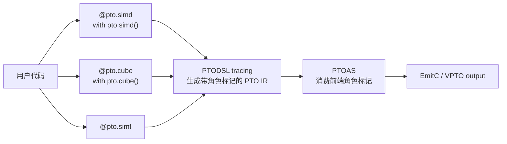
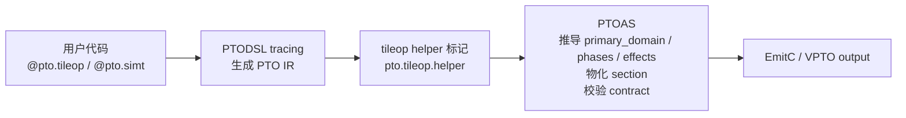
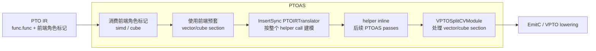
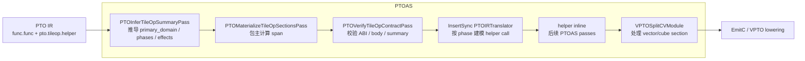

# PTODSL TileOp Subkernel Redesign Explainer

本文解释本次 PR 为什么要重做 tile-level
subkernel 的 public surface，以及 PTODSL tracing、PTO IR、PTOAS 如何配合
完成这次修改。

更精确的最终 contract 见
`docs/designs/ptodsl-redesign-of-simd-simt-cube-subkernel.md`。本文侧重背景铺垫
和方案理解。

## 1. 背景：PTODSL 在 PTOAS 中的位置

PTOAS 的底层输入是 PTO IR。PTO IR 描述数据搬运、tile 计算、同步、内存规划
和代码生成所需的信息。PTODSL 是 PTOAS 的 Python 前端：用户写 Python 函数，
PTODSL tracing 把函数体记录成 PTO IR，然后交给 PTOAS 继续做 layout、memory、
sync、EmitC 或 VPTO lowering。

一个典型流程是：

```text
Python @pto.jit function
  -> PTODSL tracing
  -> PTO IR module
  -> PTOAS
  -> EmitC / VPTO output
  -> runtime or simulator validation
```

## 2. 问题定义：旧 API 把 helper 名字和计算风格绑在一起

issue 直接推动的是 PTODSL subkernel public surface 的收敛。修改前，PTODSL
同时暴露 `@pto.simd`、`@pto.cube`、inline `with pto.simd():`、
inline `with pto.cube():` 和 `@pto.simt`。

这里的问题不是“名字太多”本身，而是 `simd` / `cube` 把两个不同层级的事情绑在
了一起：

- public surface：用户是在定义哪类 helper，它的参数和返回值边界是什么。
- 主计算风格：helper body 里真正的主计算是 Vector 还是 Cube。

tile-level helper 的自然边界是 `Tile` / `TensorView` /
`PartitionTensorView` / PTO scalar。它可以是 vector-style，也可以是
cube-style，还可能包含 MTE load/store、Scalar 控制和 sync。让用户先用
`@pto.simd` 或 `@pto.cube` 选择主计算风格，会让 API 名字、参数契约、inline
路径和 PTOAS 后续分析分叉。

因此本次设计只保留两个用户入口：

```text
tile-level custom helper -> @pto.tileop
launched SIMT helper      -> @pto.simt
```

`@pto.simt` 不合并进 `@pto.tileop`，因为 SIMT helper 面向 launched SIMT 代码，
允许 `pto.ptr(...)` 这类 raw pointer 边界；tileop helper 则是 tile/view/scalar
层面的 helper。旧 `simd/cube` surface 不再作为兼容别名继续使用，而是诊断并提示
迁移到 `@pto.tileop`。

## 3. 一个 tile-level helper 要表达什么

subkernel 是从主 kernel 里抽出来的可复用 helper。它通常不是独立 launched
kernel，而是一个会被主 kernel 调用、之后再由 PTOAS inline 或拆分处理的函数。

以 row-wise softmax 风格的 helper 为例，用户想表达的是：

```python
@pto.tileop
def row_softmax(src: pto.TensorView,
                dst: pto.TensorView,
                scratch: pto.Tile,
                rows: pto.i32,
                cols: pto.i32):
    pto.tile.load(src, scratch)
    # vector compute on scratch
    pto.tile.store(scratch, dst)

@pto.jit
def kernel(src, dst):
    row_softmax(src, dst, scratch, rows, cols)
```

这个 helper 的 public ABI 是 `src/dst/scratch/rows/cols` 这些跨调用边界可见的
值；helper body 里则有实际执行过程：

```text
MTE load -> Vector compute -> MTE store
```

这几个词在后续设计里只承担固定含义：

| 词 | 在本文中的含义 |
|---|---|
| public surface | 用户写的入口，例如 `@pto.tileop` 或 `@pto.simt` |
| public ABI | helper 参数和返回值允许跨调用边界传什么 |
| pipe | 单个 PTO IR op 的执行管线，例如 MTE、Vector、Cube、Scalar |
| phase | helper body 中相邻的一段同 pipe 操作及其边界读写摘要 |
| primary_domain | tileop helper 的主计算域，只能是 `vector` 或 `cube` |
| section | PTO IR 中标记主计算段的容器，例如 `pto.section.vector/cube` |

注意这里的 `primary_domain = vector` 不表示 helper 里只有 Vector pipe。上面的
softmax helper 同时有 MTE phase 和 Vector phase；MTE load/store 仍然是 MTE
pipe，不属于 Vector 或 Cube。

PTOAS 需要从 helper body 里恢复两类信息：

1. 这个 helper 的主计算域是什么，后续应该物化成 vector section 还是 cube
   section。
2. 每个 phase 读写了哪些跨 helper 边界的 operand，后续 InsertSync 才能在多个
   helper call 之间建同步依赖。

## 4. 方案总览

新方案把用户可见的 tile-level helper 入口统一为 `@pto.tileop`：

```python
@pto.tileop
def helper(...):
    ...

with pto.tileop():
    ...
```

SIMT 仍使用独立入口：

```python
@pto.simt
def simt_helper(ptr: pto.ptr(pto.f32, "gm"), n: pto.i32):
    ...
```

修改前，tile-level helper 的 public surface 和 PTODSL tracing 路径会先按
`simd` / `cube` 分叉：



新方案的整体职责分工如下：



这条流程的关键点是：PTODSL tracing 不再提前判断 helper 是 vector-style 还是
cube-style，也不预套 `pto.section.vector/cube`。它只把 helper 记录成 PTO IR，
并标记为 `pto.tileop.helper`。PTOAS 再根据 helper body 推导
`primary_domain`、`phases` 和边界 effect。

这样 decorated helper 和 inline `with pto.tileop():` 走同一套 PTOAS contract；
vector-style 和 cube-style helper 也不再暴露两套 public boundary 规则。

旧 `@pto.simd` / `@pto.cube` 代码迁移到 `@pto.tileop`；SIMT helper 不迁移，
仍使用 `@pto.simt`。更完整的迁移规则见第 9 节。

## 5. Public contract

`@pto.tileop` 的核心含义是：它是 tile/view/scalar 层面的 helper，不是 raw
pointer helper，也不是 launched SIMT kernel。

### 5.1 参数能传什么

`@pto.tileop` 参数只允许表达 tile-level 边界的数据：

- `Tile`：片上 tile buffer。
- `TensorView`：tensor 视图，常用作 load/store 的逻辑输入或输出边界。
- `PartitionTensorView`：已经切分好的 tensor 分区。
- PTO scalar：例如 rows、cols、scale、flag、loop bound。

不允许把这些值作为 `@pto.tileop` 参数：

- `pto.ptr(...)`：raw pointer 只给 `@pto.simt` 使用。
- host tensor / `TensorSpec`：这是 host/kernel entry 层面的整 tensor 或规格描述，
  不是 tileop helper 的边界。
- vector register、mask、pipe handle 等 helper 内部临时值或控制值。

### 5.2 结果怎么传出来

tile/view 结果通过参数传入的可写 tile/view 表达，而不是作为 Python 函数返回值
返回。

例如用户应写成“把结果写进 `out_tile` / `out_view`”：

```python
@pto.tileop
def helper(src: pto.TensorView, out: pto.Tile):
    ...
    pto.tile.store(..., out)
```

不要把 tile/view 当作函数 result 返回：

```python
@pto.tileop
def helper(src: pto.TensorView) -> pto.Tile:  # not allowed
    ...
```

当前版本只允许 scalar result。也就是说，helper 可以返回类似状态值或小标量，
但主要数据输出仍然应该写入传进来的 tile/view。

### 5.3 helper body 的边界

`@pto.tileop` helper body 可以包含数据搬运、主计算、标量控制和同步，但有几个
边界：

- 当前 tileop contract 明确禁止 helper 在函数内部自己申请新的 tile buffer。
  需要的 scratch/output tile 应由 caller 创建后作为参数传进来。实现层面会拒绝
  `alloc_tile`、`reserve_buffer`、`pto.talloc` 这类 helper-local tile allocation。
  这个限制只针对 tileop helper；普通 `@pto.jit` kernel 内仍可以使用
  `pto.alloc_tile(...)`。
- helper 必须有一个主计算域：Vector 或 Cube。MTE load/store、Scalar、sync 可以
  作为辅助阶段存在，但它们不决定主计算域。
- 一个 helper 里不要同时混用 Vector 主计算和 Cube 主计算。当前实现要求一个
  tileop helper 只表达一个主计算域。
- tileop helper 不调用另一个 tileop helper。这样每个 helper 的读写摘要都是
  局部、清楚、可验证的；递归组合多个 helper summary 留给后续设计。

## 6. 新 IR 形态

PTODSL tracing 时不再提前写 `primary_domain`、`phases`、`operand_effects`，
也不预套 `pto.section.vector/cube`。PTODSL tracing 只把 helper 标成
canonical marker：

```mlir
// PTODSL tracing 刚完成后的 helper 形态。
// attributes 里只有 pto.tileop.helper，没有 primary_domain/phases/effects。
func.func private @softmax(%src: !pto.tensor_view<...>,
                           %dst: !pto.tensor_view<...>,
                           %scratch: !pto.tile_buf<...>,
                           %rows: i32,
                           %cols: i32)
    attributes {pto.tileop.helper} {
  // body 里先保留 tracing 得到的原始 op 顺序。
  // 这里还没有 pto.section.vector 或 pto.section.cube。
  pto.tload ... outs(%scratch) : ...
  pto.tadd ... outs(%scratch) : ...
  pto.tstore ... ins(%scratch) : ...
  return
}
```

从这个例子能看出三点：

- 函数 attributes 里只有 `pto.tileop.helper`，没有
  `pto.tileop.primary_domain`。
- 函数 attributes 里也没有 `pto.tileop.phases` 和
  `pto.tileop.operand_effects`。
- body 里的 op 没有被包在 `pto.section.vector` 或 `pto.section.cube` 里面。

PTOAS 后续再基于 helper body 推导这些属性：

```mlir
attributes {
  pto.tileop.helper,
  pto.tileop.primary_domain = #pto.kernel_kind<vector>,
  pto.tileop.phases = [...],
  pto.tileop.operand_effects = [...]
}
```

这三个属性不是给用户手写的配置项，而是 PTOAS 后续 pass 基于 helper body 推导出的
内部摘要。它们具体由哪些 pass 生成、校验和消费，见第 7 节。

这样做有两个好处：

1. PTODSL tracing 不需要猜 helper 是 vector 还是 cube，也不需要维护 body pipe
   分类。
2. decorated `@pto.tileop` 和 inline `with pto.tileop()` 走同一条 PTOAS
   contract。

## 7. lib/PTO 详细设计

前面的章节说明了 public surface 和 PTODSL tracing 后的 IR 形态。真正让
`@pto.tileop` 工作起来的修改主要在 `lib/PTO`：PTOAS 不再把 PTODSL 给出的 role
当作最终答案，而是在 PTO IR 上重新推导 helper 的主计算域、phase 和边界 effect，
再把这些信息交给 section materialization、InsertSync 和 VPTO split 使用。

本节涉及的 pass / 流程状态如下：

| pass / 流程 | 状态 | 这次承担的职责 |
|---|---|---|
| helper marker 识别 | 修改 | 新增 canonical `pto.tileop.helper` marker，同时兼容旧 `pto.ptodsl.subkernel_helper = "tileop"` |
| `PTOInferTileOpSummaryPass` | 新增 | 从 helper body 推导 `primary_domain`、`phases`、`operand_effects` |
| `PTOMaterializeTileOpSectionsPass` | 新增 | 根据 summary 把主计算 span 包成 `pto.section.vector/cube` |
| `PTOVerifyTileOpContractPass` | 新增 | 校验 tileop ABI、body 约束和 summary 是否 stale |
| InsertSync 的 `PTOIRTranslator` | 修改 | helper call 不再按单个粗粒度节点建模，而是按 `pto.tileop.phases` 建同步节点 |
| `VPTOSplitCVModule` | 修改 | 在已单域 VPTO module 里也展开同域 section、删除异域 section，避免 section 留到后续 lowering |

### 7.1 Pipeline 位置

修改前，从同一个 PTOAS pipeline 视角看，tile-level helper 更依赖 PTODSL tracing
已经写好的角色标记和 section 形态。PTOAS 不会先从 helper body 推导
`primary_domain`、`phases` 和边界 effect，后续同步建模也更接近按一个 helper
call 整体处理：



PTODSL tracing 的输出是 PTO IR。带 `pto.tileop.helper` marker 的 `func.func` 进入
PTOAS 后，关键数据流如下：



这条链路里有一个核心约定：PTODSL 只负责把函数标成 tileop helper；`lib/PTO`
负责解释这个 helper。也就是说，`@pto.tileop` 的语义不是靠 frontend 预先塞一个
`vector` 或 `cube` role 完成，而是靠 PTOAS 在 IR body 上做分析完成。

### 7.2 Helper marker

新的 canonical marker 是 unit attr：

```mlir
attributes {pto.tileop.helper}
```

`include/PTO/IR/PTO.h` 里统一封装了 marker 识别逻辑：

- 有 `pto.tileop.helper` 时，helper role 解析为 `tileop`。
- 旧 IR 如果仍带 `pto.ptodsl.subkernel_helper = "tileop"`，PTOAS 仍能识别。
- 新文档和新 IR 形态使用 `pto.tileop.helper`，不再把
  `pto.ptodsl.subkernel_helper = "tileop"` 当作推荐写法。

这样做的原因是：`pto.ptodsl.subkernel_helper = "simd/cube/tileop"` 是旧的
role 字符串机制；tileop 现在是一个明确的 PTOAS contract，用 unit attr 表达比
继续复用旧字符串更清楚。

### 7.3 Summary 属性设计

`PTOInferTileOpSummaryPass` 在 tileop helper 函数上生成三类 PTOAS-owned 属性。
下面是示意形态，省略了完整 MLIR attribute assembly 的细节：

```mlir
attributes {
  pto.tileop.helper,
  pto.tileop.primary_domain = #pto.kernel_kind<vector>,
  pto.tileop.phases = [
    {
      pipe = #pto.pipe<MTE2>,
      operand_uses = [0],
      operand_defs = [2],
      result_defs = []
    },
    {
      pipe = #pto.pipe<V>,
      operand_uses = [2],
      operand_defs = [2],
      result_defs = []
    },
    {
      pipe = #pto.pipe<MTE3>,
      operand_uses = [2],
      operand_defs = [1],
      result_defs = []
    }
  ],
  pto.tileop.operand_effects = ["read", "write", "readwrite"]
}
```

这个例子可以对应：

```text
operand #0: src_view
operand #1: dst_view
operand #2: scratch_tile
```

每个属性的含义是：

| 属性 | 粒度 | 用途 |
|---|---|---|
| `pto.tileop.primary_domain` | 整个 helper | 记录主计算域是 `vector` 还是 `cube`，用于 section materialization 和 summary 校验 |
| `pto.tileop.phases` | helper body 内的 pipe phase | 记录每个 phase 的 pipe，以及这个 phase 读写了哪些 helper operand；InsertSync 用它把一个 helper call 拆成多个同步建模节点 |
| `pto.tileop.operand_effects` | helper operand | 记录整个 helper 对每个 operand 的合并 effect，用于 contract 校验和 stale-summary 检查 |

`result_defs` 当前保持为空，因为当前设计里 tile/view 输出不通过 function result
返回；function result 只允许 scalar。

### 7.4 PTOInferTileOpSummaryPass

`PTOInferTileOpSummaryPass` 是 summary-only pass。它只写属性，不改 helper body，
也不插 section。

它的算法可以概括成：

```text
for op in helper body, recursively in source order:
  pipe = classify(op)
  if pipe is Vector or Cube primary compute:
    set or validate primary_domain
  if pipe changed from previous PTO body op:
    start a new phase
  if op has MemoryEffect:
    将 op 实际读写的值追溯回 helper 参数
    在当前 phase 记录这个参数是 use 还是 def
    合并得到整个 helper 对该参数的总体 read/write effect
```

pipe 分类分两层：

- 优先通过 op 自己声明的 `getPipe()` 获取它所属执行管线，例如 MTE、Vector、
  Cube。`getPipe()` 来自 op 实现的 `OpPipeInterface`。
- 对部分没有明确 pipe interface 的 PTO op，用名字做 fallback 判断。例如
  `pto.v*` 识别为 Vector pipe，`pto.mad*` 识别为 Cube pipe，MTE load/store
  识别为对应 MTE pipe，标量 load/store 或 predicate op 识别为 Scalar pipe。

主计算域只由 Vector/Cube primary compute 决定：

- `PIPE_V` / `PIPE_V2` -> `primary_domain = vector`
- `PIPE_M` -> `primary_domain = cube`
- MTE、Scalar、sync 不决定 `primary_domain`

如果同一个 helper 里同时出现 Vector primary compute 和 Cube primary compute，
summary inference 直接报错。这对应当前“单主计算域”的实现边界。

边界 effect 的关键点是：op 实际读写的值可能是 helper 参数派生出来的内部临时值，
例如 tile slice、address value、cast 后的值或 loop iter_arg。PTOAS 不能只记录
这些内部临时值，因为 helper call 的外部边界只看得到函数参数。

例如：

```python
@pto.tileop
def helper(tile: pto.Tile, row: pto.i32):
    x = tile[row, 0:]
    v = pto.vlds(x)
    pto.vsts(v, tile[row, 0:])
```

在 IR 里，`tile[row, 0:]` 可能会变成 `memref.subview`。`vlds/vsts` 的 memory
effect 挂在这个 subview 上，但 summary 需要继续追溯，知道这个 subview 来自
helper 参数 `tile`。最终 phase 摘要记录的是“读/写了参数 `tile`”，而不是
“读/写了内部临时值 subview”。

当前实现会把 subview、cast、reshape、tile/view address、loop iter_arg 等视为
可透明追溯的中间值。追溯回 helper 参数后，只有 `Tile`、`TensorView`、
`PartitionTensorView` 这类 tileop 边界值会进入 tileop 的公开 effect 摘要。
`ptr` / `memref` 只在内部分析里用于兼容低层 IR 形态；它们不会因此变成 tileop
的合法 public ABI，verifier 仍会拒绝 `ptr` / `memref` 作为 tileop 参数。

### 7.5 PTOMaterializeTileOpSectionsPass

`PTOMaterializeTileOpSectionsPass` 消费 summary，把 helper body 中的主计算段包进
`pto.section.vector` 或 `pto.section.cube`。

它不是简单把整个 helper body 包进 section。原因是 helper 可能长这样：

```text
MTE load
Scalar loop setup
Vector compute
MTE store
```

正确的 IR 形态应该是：

```text
MTE load
Scalar loop setup
pto.section.vector {
  Vector compute
}
MTE store
```

而不是：

```text
pto.section.vector {
  MTE load
  Scalar loop setup
  Vector compute
  MTE store
}
```

materialize pass 的具体规则是：

1. 只处理标记为 tileop helper 的函数。
2. 如果 helper 里已经有 `pto.section.vector/cube`，不重复 materialize。
3. 读取 `pto.tileop.primary_domain` 和 `pto.tileop.phases`，确认存在 primary
   phase。
4. 递归进入普通控制流 region，例如 `scf.for` / `scf.if`。
5. 在每个 block 内收集 PTO body op，找到与 `primary_domain` 匹配的 primary
   compute span。
6. 当前实现要求这个 primary compute span 是连续的。如果写成
   `Vector compute A -> Scalar/MTE/sync -> Vector compute B`，materialize pass
   会报错。
7. 对 vector span，向前扩展包含产生 `mask` / `vreg` 这类 vector-scope local 值的
   producer，避免这些局部值被留在 section 外。
8. 把最终 span 包进 `pto.section.vector` 或 `pto.section.cube`，MTE/S/sync 留在
   section 外。

控制流场景是这次实现的重点之一。对于：

```mlir
scf.for %i = %c0 to %rows step %c1 {
  %slice = memref.subview %tile[%i, 0] [1, 64] [1, 1] : ...
  %v = pto.vlds %slice[%c0] : ...
  pto.vsts %v, %slice[%c0], %mask : ...
}
```

materialize pass 不应该只看 helper entry block 的顶层 op，然后因为顶层只有
`scf.for` 就放弃。现在它会递归进 loop body，在 loop body 内把 vector primary
span materialize 成 section。

### 7.6 PTOVerifyTileOpContractPass

`PTOVerifyTileOpContractPass` 是防线：它不负责推导新信息，而是确认 helper body 和
summary 没有违反 tileop contract。

它检查的内容包括：

- 参数类型只能是 `TileBufType`、`TensorViewType`、`PartitionTensorViewType` 或
  PTO scalar。
- function result 只能是 scalar。
- helper 必须至少包含一个 Vector 或 Cube primary compute op。
- 一个 helper 不能混用 Vector primary compute 和 Cube primary compute。
- helper 内不能出现 SIMT-only op，例如 thread id、launch、vote、shuffle、
  thread fence 等。
- helper 内不能分配 callee-local tile buffer，例如 `pto.alloc_tile`、
  `pto.reserve_buffer`、`pto.talloc`。
- tileop helper 不能调用另一个 tileop helper。
- `pto.tileop.primary_domain`、`pto.tileop.phases`、
  `pto.tileop.operand_effects` 必须和重新扫描 body 得到的结果一致。

最后一条很重要：summary attr 是 PTOAS 后续 pass 的输入，如果 body 被改了但
summary 没更新，InsertSync 或 section materialization 看到的就会是 stale 信息。
verifier 通过重新推导一遍 summary 来发现这种不一致。

### 7.7 InsertSync 如何消费 tileop summary

InsertSync 在 `PTOIRTranslator` 里把 IR 转成 sync solver 能理解的 dependency
graph。普通 PTO op 可以直接根据 op 的 def/use 建图；helper call 不一样，因为
call 本身看不到 callee body 的内部 pipe。tileop summary 就是给 helper call
使用的 callee-side 摘要。

当 translator 看到：

```mlir
func.call @row_softmax(%src, %dst, %scratch) : ...
```

它会查 `@row_softmax` 是否是 tileop helper。如果是，则读取：

```text
pto.tileop.phases
pto.tileop.operand_effects
```

然后把 phase 里的 operand index 映射回 call operand：

```text
phase operand_uses = [0]  -> use %src
phase operand_defs = [2]  -> def %scratch
```

每个带边界 effect 的 phase 会变成一个 `CompoundInstanceElement`。这个节点携带：

- pipe：来自 phase 的 `pipe`
- use values：phase 读的 call operands
- def values：phase 写的 call operands
- macro phase id：保持同一个 helper call 内 phase 的顺序身份

如果某个 phase 没有 boundary use/def，translator 会跳过它；纯内部 phase 不需要
成为跨 helper call 的同步边界节点。

#### 7.7.1 和旧同步建模的对比

这里改的不是 sync solver 本身，而是 helper call 进入 dependency graph 前的
建模方式。sync solver 仍然根据 use/def 和 pipe 信息判断哪些 op 之间需要同步；
区别在于旧方案给它的是一个粗粒度 helper call 节点，新方案给它的是多个
phase-level 节点。

从“建立 hazard 之前”的流程看，差异在 `PTOIRTranslator` 把 helper call 翻译成
SyncIR 节点这一步：

```mermaid
flowchart TB
  subgraph Old["旧 simd/cube helper"]
    OldCall["func.call @helper(%src, %dst, %scratch)"]
    OldRole["读取前端 role<br/>simd / cube"]
    OldOperands["扫描 memory-like call operands"]
    OldNode["生成 1 个 CompoundInstanceElement<br/>pipe = role 对应 pipe<br/>operands = 保守 read+write"]
    OldHazard["InsertSyncAnalysis<br/>基于这个粗粒度节点建立 hazard"]

    OldCall --> OldRole --> OldOperands --> OldNode --> OldHazard
  end

  subgraph New["当前 tileop helper"]
    NewCall["func.call @helper(%src, %dst, %scratch)"]
    NewSummary["读取被调 helper 的 summary<br/>pto.tileop.phases / operand_effects"]
    NewMap["把 phase operand index<br/>映射回 call operand"]
    NewNodes["生成多个 CompoundInstanceElement<br/>每个 phase 一个 pipe、use、def 节点"]
    NewHazard["InsertSyncAnalysis<br/>基于 phase 节点建立 hazard"]

    NewCall --> NewSummary --> NewMap --> NewNodes --> NewHazard
  end
```



| 对比项 | 旧 `simd/cube` helper | 当前 `tileop` helper |
|---|---|---|
| call 边界信息来源 | 前端 role 和 call operands | `pto.tileop.phases` / `pto.tileop.operand_effects` |
| 建图粒度 | 一个 helper call 近似成一个整体节点 | 一个 helper call 拆成多个带 pipe 的 phase 节点 |
| operand effect | memory-like operand 通常保守按 read+write 建模 | 按 summary 记录的 use/def 建模 |
| pipe 信息 | 主要来自 helper 的粗粒度 role，例如 vector-style | 来自每个 phase 的 pipe，例如 MTE、Vector、MTE |
| 对纯内部 phase 的处理 | 难以区分内部 effect 和边界 effect | 没有 boundary use/def 的 phase 不进入跨 call 同步边界 |

例如一个 helper body 是：

```text
MTE load(src -> scratch)
Vector compute(scratch)
MTE store(scratch -> dst)
```

旧方案在两个连续 helper call 之间只能把整个 call 近似成一个读写边界节点；
InsertSync 看不到 load、compute、store 三个阶段各自读写了哪个 helper 参数。

当前方案会把这个 call 表达成类似下面的 phase 摘要：

```text
phase 0: pipe = MTE,    use src,     def scratch
phase 1: pipe = Vector, use scratch, def scratch
phase 2: pipe = MTE,    use scratch, def dst
```

InsertSync 再把这些 phase 逐个放进 dependency graph。这样它在跨 helper call
判断依赖时，看到的是每个阶段的真实边界读写，而不是一个保守的大节点。

### 7.8 VPTOSplitCVModule 的 section rewrite

VPTO lowering 前，`pto.section.vector/cube` 需要被归到对应 module 形态里处理。
`VPTOSplitCVModule` 的职责是把 section sugar 变成 VPTO lowering 能消费的结构：

- 如果 module 还没有 `pto.kernel_kind`，并且函数里同时有 vector/cube section，
  pass 会 clone 出 vector/cube 两个 module。
- 生成 vector module 时，展开 `pto.section.vector`，删除 `pto.section.cube`。
- 生成 cube module 时，展开 `pto.section.cube`，删除 `pto.section.vector`。
- 如果 module 已经带 `pto.kernel_kind`，也要做同样的 section rewrite：同域
  section 展开，异域 section 删除。

最后一点是这次修复的重要边界。否则在已单域化的 VPTO module 中，
`pto.section.vector/cube` 可能遗留到 LLVM lowering；section 内如果包含控制流，
后续转换会让 section region 形态不再满足 verifier 约束。

### 7.9 设计边界

这套 `lib/PTO` 设计刻意把几件事分开：

- summary inference 只负责“看懂 helper”，不改 IR body。
- section materialization 只负责“把主计算 span 结构化”，不重新定义 ABI。
- contract verifier 负责“发现非法 helper 或 stale summary”，不修正用户代码。
- InsertSync 只消费 summary 建 dependency graph，不再重新进入 callee body 分析。
- VPTO split 只处理 section sugar 和 module kind，不参与 tileop ABI 判断。

这种拆分让每个 pass 的输入输出都比较明确：前一个 pass 产出的属性或 section，
是后一个 pass 的显式输入；如果中途被改坏，verifier 会尽早报错。

## 8. 相比旧方案新增或收紧的限制

旧 `@pto.simd` / `@pto.cube` 路径主要依赖 frontend role 和预套 section。新
`@pto.tileop` 路径把 helper 交给 PTOAS 推导和校验，因此也把一些边界变成了明确
诊断。先从用户写 PTODSL 时能直接感知到的限制看：

### 8.1 用户写 PTODSL 时会看到的限制

| 用户写法 | 旧方案形态 | 当前 tileop 形态 |
|---|---|---|
| `@pto.simd` / `@pto.cube` | 作为 public decorator 使用 | 作为旧接口诊断报错，tile-level helper 统一写 `@pto.tileop` |
| tileop 参数 | 旧 simd/cube 的参数边界不统一 | `@pto.tileop` 只允许 `Tile`、`TensorView`、`PartitionTensorView`、PTO scalar |
| `pto.ptr(...)` 参数 | 容易被误认为 tile-level helper 也能接收 | 仍然只允许 `@pto.simt`；`@pto.tileop` 不能用 raw pointer 作为 public boundary |
| tile/view 输出 | 容易被误写成 function result | 通过 output operand 传出；function result 只允许 scalar |
| helper 内申请 tile | 普通 kernel 里可以 `pto.alloc_tile(...)` | `@pto.tileop` helper 内不能新建 helper-local tile buffer；scratch/output tile 由 caller 传入 |
| helper body | 由 `simd` / `cube` 名字暗示主域 | body 必须真的包含 Vector 或 Cube primary compute，不能只有 MTE/Scalar/sync |
| 混合 Vector/Cube | 旧名字无法清楚表达混合语义 | 同一个 `@pto.tileop` helper 不能同时写 Vector primary compute 和 Cube primary compute |
| helper 互调 | 没有清晰的 phase summary 组合语义 | `@pto.tileop` helper 不能调用另一个 `@pto.tileop` helper |
| SIMT 操作 | 容易和 tile-level helper 混用 | thread id、launch、vote、shuffle、thread fence 等 SIMT-only op 只放在 `@pto.simt` |

### 8.2 PTOAS 内部额外收紧的检查

还有一些限制用户不一定会在 Python 写法里直接看到，但会影响手写 IR、其他
frontend，或后续 PTOAS pass 的输入：

| 检查项 | 旧方案形态 | 当前 tileop 形态 |
|---|---|---|
| 后端 helper ABI | frontend / backend 边界规则容易分叉 | verifier 在 PTO IR 层拒绝 `ptr` / `memref` 作为 tileop helper 参数 |
| summary 一致性 | 没有 `primary_domain/phases/effects` 这组属性 | verifier 会重新扫描 body，确认 summary 没有 stale |
| 主计算 span | 旧路径常把整个 helper body 预套进一个 section | 当前只 materialize 主计算 span；同一个 block 内 primary compute 中间不能夹非 primary pipe |
| sync 建模输入 | helper call 可被保守看成单个 read/write 节点 | InsertSync 按 `pto.tileop.phases` 建多个 phase 节点，summary 缺失或错误会被拒绝 |
| section rewrite | section 可能留到后续 lowering | 已单域 VPTO module 里也会展开同域 section、删除异域 section |

这些限制不是为了减少 tileop 能力，而是为了让当前版本的 ABI、summary、sync 和
section 语义先保持可验证。后续如果要放开某一项，需要同时定义它对 summary、
InsertSync 和 VPTO section rewrite 的影响。

## 9. 方案同时覆盖的问题和收益

前面第 7 节解释了 `lib/PTO` 如何落地这套设计，第 8 节列出了当前实现收紧的边界。
本节再总结这套实现同时带来的收益和覆盖面。它们不是 issue 一开始逐条提出的问题，
但统一到 `@pto.tileop` 后，这些相关边界可以一起收敛。

### 9.1 tile-level helper 只保留一套 public contract

旧 API 把 helper 名字直接命名成 `simd` 或 `cube`。这看起来直观：做 vector
计算就写 `simd`，做 cube 计算就写 `cube`。但对 PTOAS 来说，这两类 helper
共享同一个更重要的 contract：它们都是 tile-level helper，参数边界应该是
tile/view/scalar，调用边界需要有 read/write effect，body 里也都可能包含
MTE、主计算、Scalar/sync 等多个 phase。

统一成 `@pto.tileop` 后，vector-style 和 cube-style 不再拥有两套 public
boundary 规则、两套诊断文案、两套 inline/decorated 处理路径。区别保留在
`primary_domain = vector/cube`，由 PTOAS 从 body 推导。

### 9.2 phase summary 让跨 helper 调用的同步更清楚

还要区分“helper 里实际出现了多个 pipe”和“PTOAS 在 helper 调用边界看到的摘要
粒度”。前者说的是 helper body 真实做了哪些事；后者说的是 PTOAS 在处理

```text
call @row_softmax(...)
call @row_softmax(...)
```

这类连续 helper 调用时，能看到多少内部读写信息。

旧 `simd`/`cube` 路径会把整个 helper call 压成一个粗粒度节点，例如“这是一个
vector-style call”。这不表示 helper 里面真的只有 Vector pipe，而是表示 PTOAS
只能把这个 call 当成一个整体来建模。它看不到这个 call 内部其实有
`MTE load -> Vector compute -> MTE store` 三个阶段，也就无法分别知道：

- MTE load 阶段读哪个输入 view、写哪个 scratch tile。
- Vector compute 阶段读写哪个 tile。
- MTE store 阶段读哪个 tile、写哪个输出 view。

这就是“跨 call 建同步时丢掉阶段结构”的意思：不是 IR 里的操作消失了，而是
PTOAS 在两个 helper call 之间判断依赖和插同步时，只拿到一个大粒度 call 摘要，
拿不到每个 phase 的读写摘要。

新的 `pto.tileop.phases` 用来表达这些 phase-level 信息。注意这不表示 MTE
load/store 属于 Vector；它们仍是 MTE pipe，只是和 Vector 主计算共同构成一个
`primary_domain = vector` 的 tileop helper。

### 9.3 section 由 PTOAS 物化，避免 PTODSL tracing 过早判断

section 是 PTO IR 里的结构化容器，用来告诉 PTOAS “这一段是 vector 主计算”
或“这一段是 cube 主计算”：

```mlir
pto.section.vector {
  // vector primary compute
}
```

section 不是“整个 helper 的容器”。它只应该包主计算段。MTE load/store 是数据
搬运，Scalar/sync 是辅助控制或同步；这些 op 通常应该留在主计算 section 外面。
也就是说，一个典型 helper 更接近：

```text
MTE load
pto.section.vector {
  Vector compute
}
MTE store
```

新方案让 PTODSL tracing 只标记 `pto.tileop.helper`，不预套 section。PTOAS 先
推导 summary，再递归进入控制流 body，找到连续的主计算 span 后只包这段，
MTE/S/sync 保持在 section 外。这样 decorated helper 和 inline helper 也能走
同一条 contract。

### 9.4 tileop ABI 收敛到 Tile/View/Scalar，ptr 保留给 SIMT

ABI 在这里指 helper 的参数和返回值 contract：哪些值允许跨 helper 边界，哪些
值只能留在 helper 内部。对 tileop 来说，用户关心的是 tile-level 数据结构，而
不是 raw pointer：

- `Tile` 表示片上 tile buffer。
- `TensorView` 表示一个 tensor 视图，可作为 load/store 的逻辑边界。
- `PartitionTensorView` 表示已经切分好的 tensor 分区。
- PTO scalar 表示 rows、cols、scale、loop bound 等标量参数。

这些类型足够表达 tile-level helper 的自然边界。例如 softmax helper 可以读
一个 `TensorView`，使用一个 `Tile` 做 scratch，再写一个 output view。

`pto.ptr(...)` 不同。它是 raw pointer 风格的低层 ABI，适合 SIMT launched
helper。raw pointer 只表达一段地址，不携带 tile/view 的结构化边界语义。因此
tileop contract 收敛为：

```text
tileop: Tile / TensorView / PartitionTensorView / PTO scalar
simt:   pto.ptr(...) and SIMT-specific boundary
```

### 9.5 控制流和 tile slice 的建模更完整

PTODSL 用户写 Python `for`/`if` 时，PTODSL tracing 会把它们记录成设备侧控制流，
而不是在 Python 编译期展开。MLIR 里常见形式是 `scf.for` / `scf.if`。PTODSL
用户写 `tile[row, col:]` 这类切片时，IR 里常见形式是 `memref.subview` 或 PTO
自己的 view/tile address op。

tracing 到 MLIR 后，它们会变成类似这样的结构：

```mlir
scf.for %i = %c0 to %rows step %c1 {
  %slice = memref.subview %tile_addr[%i, 0] [1, 64] [1, 1]
  %v = pto.vlds %slice[%c0] : ...
  pto.vsts %v, %out_slice[%c0], %mask : ...
}
```

对不熟 MLIR 的读者，可以把它理解成：

- `scf.for` 是 IR 里的结构化 loop。
- `memref.subview` 是从一个 tile/view 中取出一段 slice，例如第 `i` 行。
- `vlds/vsts` 可能真正读写的是 subview 结果，而不是函数参数本身。

这套方案要求 PTOAS 递归查看控制流 body，能看到 loop/if 内的主计算 op；同时
识别由 helper 边界 operand 派生出的透明 view、tile address、cast、subview 等
来源，能把 tile slice 的 effect 归回对应 helper 参数。这样 PTOAS 才能为常见
row-wise/tile-slice helper 建出正确的跨 call 依赖。

## 10. 用户迁移方式

用户原来写：

```python
@pto.simd
def helper(...):
    ...

@pto.cube
def matmul_helper(...):
    ...
```

现在统一写：

```python
@pto.tileop
def helper(...):
    ...
```

如果是 launched SIMT helper，仍然写：

```python
@pto.simt
def helper(ptr: pto.ptr(pto.f32, "gm")):
    ...
```

判断标准是：

- 参数是 tile/view/scalar，body 是 tile-level load/compute/store：用
  `@pto.tileop`。
- 参数是 raw pointer，body 是 SIMT-style launched code：用 `@pto.simt`。

旧代码里如果看到 `@pto.simd` 或 `@pto.cube`，迁移时不要按名字一比一替换成
新的 Vector/Cube 专用 decorator，因为新设计没有这两个专用 decorator。统一改
成 `@pto.tileop`，再让 PTOAS 从 body 推导 vector-style 或 cube-style 主域。

## 11. 常见问题

### MTE load/store 属于 vector 还是 cube？

都不属于。MTE load/store 属于 MTE pipe，是数据搬运阶段。一个 helper 的
`primary_domain` 由主计算 phase 决定：

- `MTE load -> Vector compute -> MTE store` 的主域是 `vector`。
- `MTE load -> Cube compute -> MTE store` 的主域是 `cube`。

因此文档中说 “vector-style helper 包含 MTE phase” 时，不是在说 MTE 属于
Vector，而是在说同一个 tileop helper 的执行过程可能包含多个 pipe。

### 为什么 tileop 只能有一个 primary_domain？

这是当前实现边界。一个 helper 如果同时包含 Vector 主计算和 Cube 主计算，PTOAS
需要决定如何拆 section、如何拆 kernel module、如何在两个主域之间建同步。这些
规则比单主域复杂很多。当前 contract 要求一个 tileop helper 只表达一个主计算
域，MTE/S/sync 作为辅助 phase。

### 为什么 `pto.ptr(...)` 不能传给 tileop？

`pto.ptr(...)` 是低层 pointer ABI，适合 SIMT launched helper。tileop 的目标是
让 helper 站在 tile/view/scalar 层面建模，这样 PTOAS 能基于结构化信息做
memory、sync 和 section 处理。允许 raw pointer 进入 tileop ABI 会绕开这些
结构化边界，所以仍保留为 SIMT-only。

### 为什么不把所有 operand 都统一标成 readwrite？

统一 readwrite 最保守，通常不容易漏同步，但会丢掉 phase 级别的真实依赖，
可能引入不必要的同步，也让 PTOAS 无法判断哪些 phase 真的跨 helper 边界产生
effect。`pto.tileop.phases` 的目的就是让 helper call 的同步模型更接近真实
读写行为。

### 为什么要禁止 tileop helper 调用另一个 tileop helper？

如果 helper A 调 helper B，PTOAS 需要递归组合两个 helper 的 summary、phase 和
operand effect，还要处理 inline 后可能产生的跨域 section 嵌套。当前版本先
禁止 tileop helper 互调，保证每个 helper 的 summary 是局部可验证、可消费的。

## 12. 测试覆盖

本次修改对应的测试覆盖分几层：

- PTODSL Python tests：验证 public API、legacy diagnostic、inline/decorated
  tileop 行为。
- PTO lit tests：验证 helper ABI、summary、contract verifier、memory planning
  和 sync。
- VPTO lit tests：验证 section materialization、control-flow body、single-kind
  module section rewrite。
- DSL ST simulator：验证实际 PTODSL runtime/simulator 路径，例如
  `vmulscvt.py`、`predicate_pack.py`、`cube_matrix_pipeline.py`。

关键回归包括：

- tileop 允许 `Tile` / `TensorView` / `PartitionTensorView` / scalar。
- tileop 拒绝 `ptr`；SIMT 仍接受 `ptr`。legacy `simd/cube` public surface 会
  先被 PTODSL frontend 迁移诊断拒绝。
- tile slice 经 `memref.subview` 后仍能被 summary effect 识别。
- control-flow 内的 primary compute 能被 materialize 成 section。
- mask/vreg local producer 不会逃出 vector scope。
- 已单域 VPTO module 中的 section 会在 lowering 前被展开。

## 13. 当前仍需注意的点

第 8 节已经列出相比旧方案新增或收紧的限制。除此之外，使用当前实现时还要注意：

- function result 只允许 scalar；tile/view 输出仍通过 output operand 表达。
- 无显式 boundary effect 的 operand 默认记录为 `read`；真实读写边界 tile/view
  的 op 需要通过 MemoryEffect 和 boundary value trace 进入 phase summary。

这些边界不是因为 PTOAS/VPTO 永远无法支持，而是为了让当前 public contract 和
sync/memory/codegen 行为先稳定下来。
