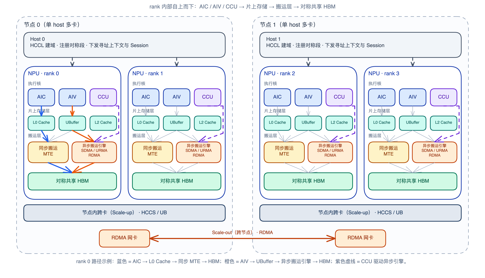
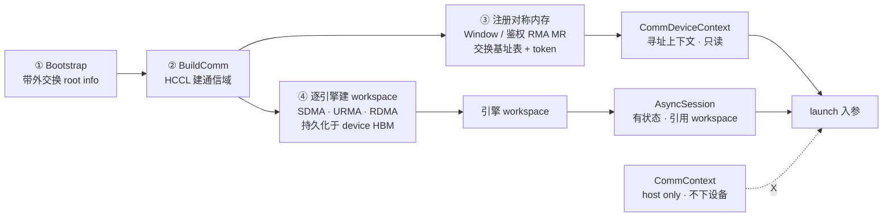
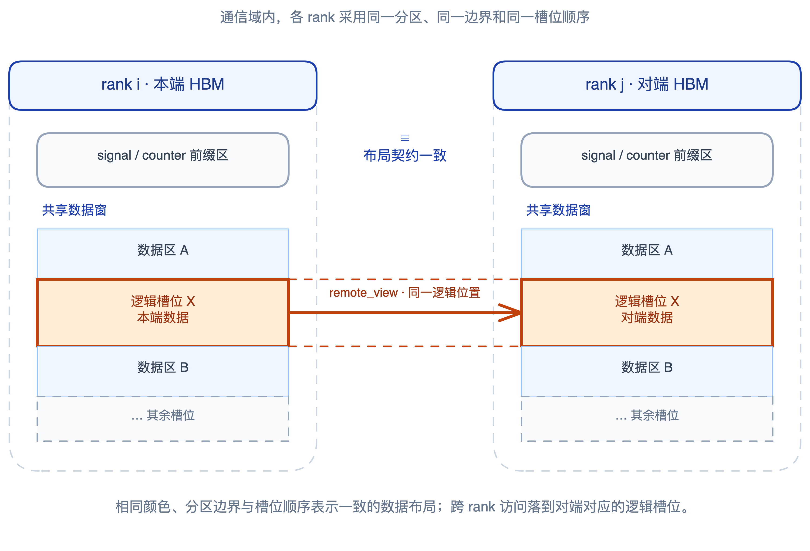
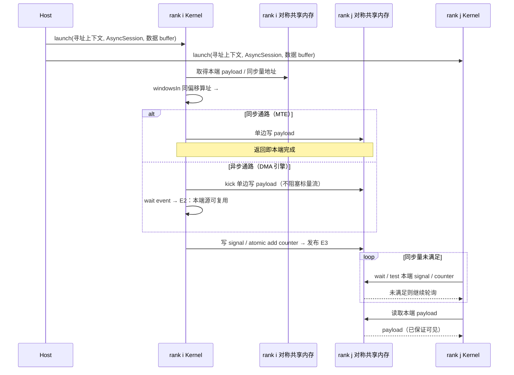

# VPTO 通信模型

本文描述跨 rank 通信的编程模型：对称共享内存、单边访问、完成与可见性约定，
以及 `comm_scope` 边界。

非目标：集合通信算法、Runtime HCCL 绑定细节、Tile 层 DSL、CCU。

## 1. 范式

采用 **PGAS / SHMEM** 式对称共享内存 + 单边访问：各 rank 共享段布局一致，
设备侧以「本端指针 + 目标 rank」读写对端同偏移数据，无需对端参与。

跨卡交换收敛为三件事：**寻址、搬运、显式同步**。Scale-up（节点内）与
Scale-out（跨节点）只更换引擎与通路，不改变编程面。



一次通信分两阶段：

- **Host 准备期**：建通信域、协商对称共享段、按需注册鉴权 MR、初始化异步引擎；
  随 launch 下发寻址上下文（只读）与引擎会话（有状态）。二者职责分离即可，
  字段级 ABI 不在本文展开。
- **NPU 运行期**：kernel 内算址、发起搬运、用同步量或融合形态约定跨卡可见性。



## 2. 共享内存与指针属性

跨卡地址空间一律 `gm`。远近与鉴权不另开地址空间，由可组合指针属性表达：

| 形态 | 含义 |
|------|------|
| `!pto.ptr<T, gm>` | 本端、普通共享内存 |
| `!pto.ptr<T, gm, #pto.mr<rma>>` | 本端、已注册鉴权 RMA MR |
| `!pto.ptr<T, gm, #pto.remote>` | 远端、普通共享内存 |
| `!pto.ptr<T, gm, #pto.mr<rma>, #pto.remote>` | 远端且已注册 |

`#pto.remote` 管远近，`#pto.mr<rma>` 管鉴权；缺省分别为本端、未注册。
同偏移算址由调用方用 `CommDeviceContext.windowsIn[]` 自行完成：

```text
remote = windowsIn[peer] + (local − windowsIn[myRank])
```

结果以 `pto.castptr` 等既有手段成型为 `!pto.ptr<T, gm, #pto.remote>`（可与
`#pto.mr<rma>` 组合）。不设专用 remap op。



## 3. 完成与可见性（E2 / E3）

| 事件 | 保证 | 观测 |
|------|------|------|
| **E2** | 本端 source 可复用 | 异步：轮询搬运返回的 CQ 完成记录；同步 MTE：指令/pipe 完成即成立 |
| **E3** | 对端可见本次 payload | 写远端同步量，或使用融合 `*_signal` / `*_counter` |

E2 与 E3 相互独立：等到 E2 **不**代表对端可见。分离写法必须先到 E2 再发同步量；
融合形态同事务保证，对端观测到同步量即可读 payload。



跨 rank E3 **不**复用 `cmo.cacheinvalid` / `fence.barrier_all`（核间粗栅栏）。

## 4. 同步量（内存约定，无新 op）

跨 rank 同步量是对称段内用户自划的 `i32` 位置，不是专用指令族：

| 用法 | 写者 | 发布 |
|------|------|------|
| **signal** | 单写者 | `stg` / `store` / 远端 `mte_ub_gm` |
| **counter** | 多写者汇合 | `atomic_add` |

观测：本端 `dcci` + `ldg`；等待写成 IR 轮询。与片上 SC 信号量
（`set_intra_core` 等）互不合并：核间用 SC，跨 rank 用 GM 同步量。

## 5. 融合搬运+同步

异步通路可将 E3 发布并进同一搬运事务：`*_gm_gm_signal` / `*_gm_gm_counter`。
这是跨 rank 同步唯一新增的 mnemonic 族；独立发布仍用 §4 的普通访存。
MTE 同步通路无融合形态。

## 6. `comm_scope`

`comm_scope` 是 `section.vector` / `section.cube` 内的词法区域，给通信资源
（session / 完成记录等）划寿命边界，并作为 sync 分析锚点。应对齐
`pto.vecscope` 写在 `docs/vpto-spec.md` 的层级；本节暂存约定，后续迁入该处。

```mlir
pto.section.vector {
  pto.vecscope { /* 计算 */ }
  pto.comm_scope {
    %dst = pto.castptr %remote_i64 : i64 -> !pto.ptr<f16, gm, #pto.remote>
    %cq = pto.sdma_gm_gm %dst, %src, %nbytes session(%sess)
      -> !pto.ptr<i64, gm>
  }
}
```

| 项 | 约定 |
|----|------|
| 位置 | `section.vector` / `section.cube`；**不**进入 `vecscope` |
| 职责 | 资源寿命边界 + Sync 分析锚点 |
| vs `vecscope` | 通信 kick、同步量读写、session、远端指针构造落在 `comm_scope` |
| 推断 | session/event 流可按 SSA 穿线推断；纯同步量流需显式书写 |
| cube | AIC 只发 GM↔GM kick 时 PlanMemory 锚点弱化；资源/Sync 锚点仍成立 |

开放问题：出口是否默认强制 E2（与正确性正交，影响跨窗 overlap）。

## 7. 通路总览

| 通路 | 承载 |
|------|------|
| 同步远端 | 核内 MTE：`mte_gm_ub` / `mte_ub_gm` + `#pto.remote` |
| 异步 GM↔GM | SDMA / URMA / RDMA + session |
| 融合 notify | `*_gm_gm_signal` / `*_gm_gm_counter` |
